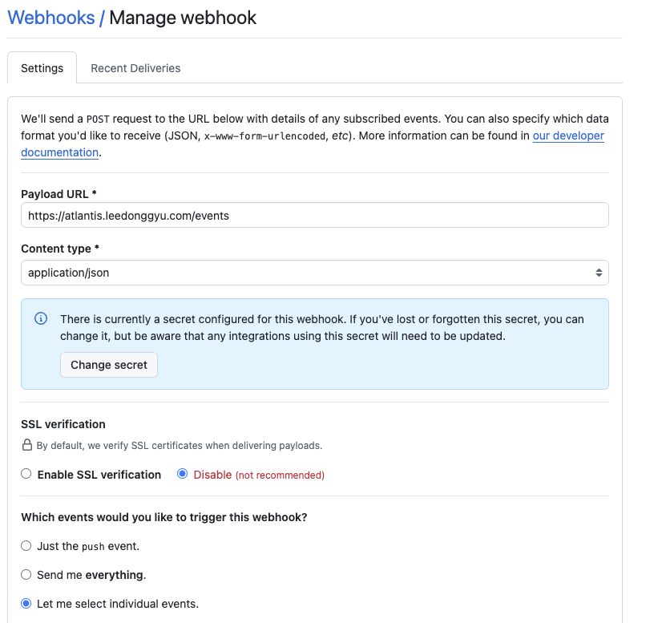
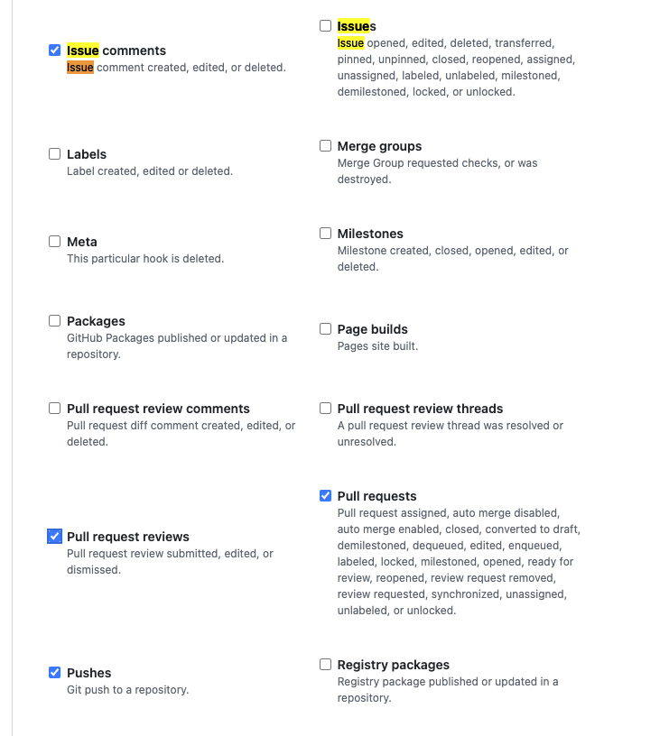
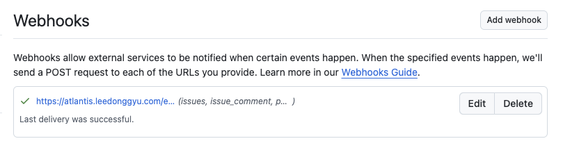
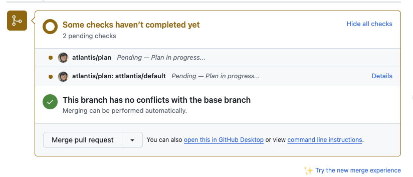
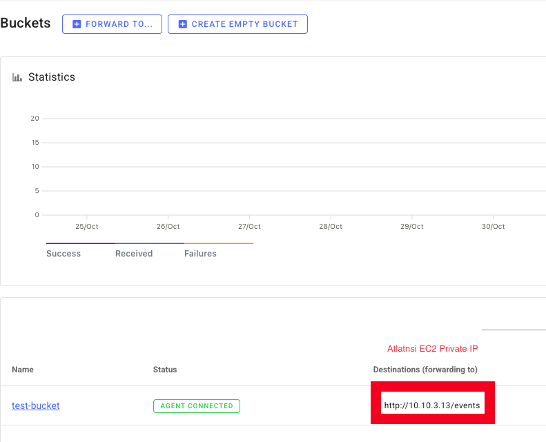

# Atalntis

## Install Docker 

```sh
sudo yum install -y docker
sudo usermod -aG docker ec2-user
sudo systemctl enable --now docker
exec bash

sudo docker ps

sudo mkdir -p /usr/local/lib/docker/cli-plugins/
sudo curl -SL "https://github.com/docker/compose/releases/latest/download/docker-compose-linux-$(uname -m)" -o /usr/local/lib/docker/cli-plugins/docker-compose
sudo chmod +x /usr/local/lib/docker/cli-plugins/docker-compose

docker compose version
```

## install use ECS Fargate

[ecs code](./attlantis/ecs-fargate/main.tf)

## 1. webhook url 등록하기






## 2. Webhook Relay 를 사용해서 Atlantis 구축하기

### Stage...

- Webhook Relay내 Bucket 생성 / Destinatino 생성하기



- Webhook Relay 에 Bucket 모두 추가하기

```sh
services:
  webhookrelay:
    image: webhookrelay/webhookrelayd:latest
    container_name: webhookrelay
    restart: unless-stopped
    network_mode: host  # localhost 접근 필수
    environment:
      - RELAY_KEY=${RELAY_KEY}
      - RELAY_SECRET=${RELAY_SECRET}
      - BUCKETS=test-bucket 
```

- Github Actino 내에서 Webhook 잘되는지 체크하기

### 참고

- [Atlantis EC2 구성](./ATLANTIS.md)
- [Webhook Relay 구성](./WEBHOOK_RELAY.md)


## Best Practice

- AWS_ACCESS_KEY_ID, AWS_SECRET_ACCESS_KEY를 환경변수에 넣고 활용...
- 깃 레포에 특정 폴더 하위만 진행하기

## Reference

- <a href="https://registry.terraform.io/modules/terraform-aws-modules/atlantis/aws/latest?tab=inputs"> Atalntis Terraform Module </a>
- <a href="https://webhookrelay.com/blog/using-drone-for-simple-selfhosted-ci-cd"> WebHook Relay Self hosted </a>