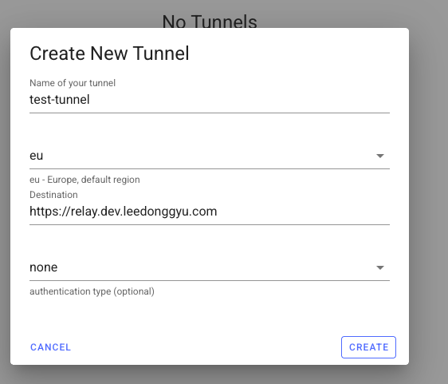
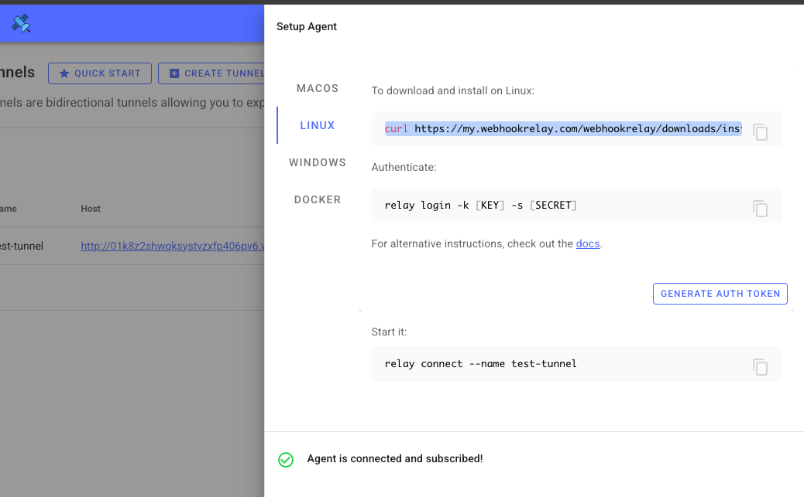

# Webhook Relay

## docker-compose.yml

```sh
version: '3.2'
services:
  relay:
    container_name: webhookrelay
    image: webhookrelay/webhookrelayd:latest
    network_mode: host # required if you want to access other services running on localhost (otherwise localhost would be inside this container)
    restart: always
    environment:
      # Authentication
      - RELAY_KEY=${RELAY_KEY}
      - RELAY_SECRET=${RELAY_SECRET}
      # buckets list to subscribe
      - BUCKETS=${BUCKETS}

```

## .env
```sh
    RELAY_KEY=
    RELAY_SECRET=
    BUCKETS=
```

## Webhook Relay 에서 설정하기





## 참고

- <a href="https://webhookrelay.com/blog/using-drone-for-simple-selfhosted-ci-cd"> Webhook Relay Self hosted </a>